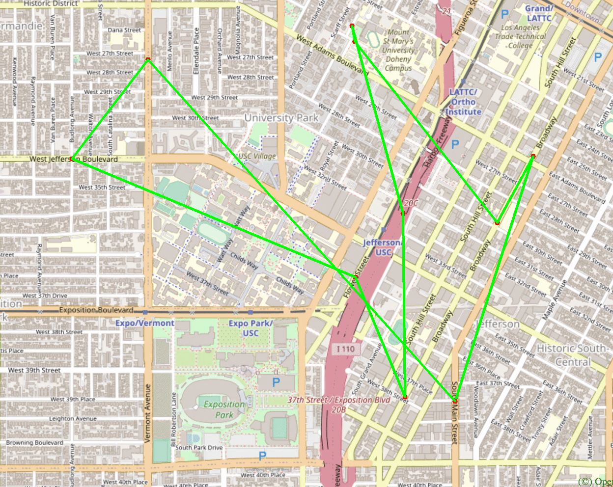

# Trojan Map

This is the final project of EE599 (Computer Principles) in Spring 2021 at University of Southern California.

Author: Haoxin Ma, Ziyou Geng  

## To Dear TAs

We have our self-designed GUI using Qt for an extra 10 points for this project, which has already got the permission from Prof Arash Saifhashemi.

The repo link: https://github.com/HaoxinMa/Trojan-Map

Here are some output preview.


## Source Code Dependencies 

- ### gcc

  ```shell
  sudo apt update
  sudo apt install build-essential
  ```

- ### Bazel

  See https://docs.bazel.build/versions/4.0.0/install-ubuntu.html#install-on-ubuntu

- ### git

  ```shell
  sudo apt update
  sudo apt install git
  ```

- ### OpenCV

  ```shell
  mkdir ./opencv
  git clone https://github.com/opencv/opencv.git
  sudo apt update
  sudo apt install libgtk2.0-dev libcanberra-gtk-module libcanberra-gtk3-module
  cd opencv/
  mkdir build install
  cd build/
  cmake -D CMAKE_INSTALL_PREFIX= ../install\
   -D BUILD_LIST=core,highgui,imgcodecs,imgproc,videoio\
   -D WITH_TBB=ON -D WITH_OPENMP=ON -D WITH_IPP=ON\
   -D CMAKE_BUILD_TYPE=RELEASE -D BUILD_EXAMPLES=OFF\
   -D WITH_NVCUVID=ON\
   -D WITH_CUDA=ON\
   -D BUILD_DOCS=OFF\
   -D BUILD_PERF_TESTS=OFF\
   -D BUILD_TESTS=OFF\
   -D WITH_CSTRIPES=ON\
   -D WITH_OPENCL=ON ..
  make install
  ```

## Directory Description

`./bazel-*`			GoogleTest output files  
`./opencv`			OpenCV source files  
`./src`				C++ source files  
`./tests`			GoogleTest files  
`./ncurses.BUILD`	ncurses build file  
`./opencv.BUILD`	OpenCV build file  
`./WORKSPACE`		bazel build file  

## Overview  

  ### Functionalities

  - Auto Complete location names
  - Find Coordinates
  - Calculate Shortest Path
    - Dijkstra
    - Bellman-ford
  - Traveling Salesman Problem
    - Brute-force
    - 2-opt
  - Cycle Detection
  - Topological Sort

  ### Data structure  

  ```c++
class Node {
    public:
    string id;                 // A unique id assigned to each point
    double lat;                // Latitude
    double lon;                // Longitude
    string name;               // Name of the location
    vector<string> neighbors;  // List of the ids of all neighbor points
};

class TrojanMap {
    public:
    map<string, Node> data;    // A map of ids to Nodes
    ...
};
  ```

Data of each node is stored in map.csv (take "Tommy Trojan" for example)

```
id,lat,lon,name,neighbor
2305853438,34.0205678,-118.2854346,Tommy Trojan,['2305853437']
```

## Time Complexity Analysis and Results 

  ### Auto Complete location names  

We consider the names of nodes as the locations. Implement a method to type the partial name of the location and return a list of possible locations with partial name as prefix. Please treat uppercase and lower case as the same character.

  ```c++
vector<string> TrojanMap::Autocomplete(string name) {
    ...
        for (auto pr : data) { // O(v)
            transform(pr.second.name.begin(), pr.second.name.end(), str.begin(), ::tolower); // O(l)
            ...
        }
    ...
}
  ```

Time complexity: O(v*l),

where v is the number of vertices (locations), l is the max length of a location name 

> Example:
>
> Input: "k"
>
> Result:  
>
> ```
> *************************Results******************************
> Kentucky Fried Chicken
> Korean Presbyterian Church
> Kobunga Korean Grill
> Kaitlyn
> **************************************************************
> ```
> Time taken: 1.848 ms

  ### Find Coordinates  

Given a location name, return the latitude and longitude. There are no duplicated location names. You should mark the given locations on the map. If the location does not exist, return (-1, -1).

  ```c++
pair<double, double> TrojanMap::GetPosition(string name) {
    ...
        for (auto pr : data) {...} // O(v)
    ...
}
  ```
Time complexity: O(v),

where v is the number of vertices (locations)  

> Example: 
>
> Input: "Kentucky Fried Chicken"
>
> Result:
> 
>
> Time taken:  0.791 ms

  ### Calculate Shortest Path  

Given 2 locations A and B, find the best route from A to B. The distance between 2 points is the euclidean distance using latitude and longitude. You should use both Dijkstra algorithm and Bellman-Ford algorithm. Compare the time for the different methods. Show the routes on the map. If there is no path, please return empty vector.

  #### Dijkstra
  ```c++
vector<string> TrojanMap::CalculateShortestPath_Dijkstra(string location1_name, string location2_name) {
    ... 
    while (!q.empty()) { 
        ...                                     // O(v)
        for (auto nb_id : data[id].neighbors) { // O(e)
            ...
            q.push(make_pair(new_dis, nb_id));  // O(log(e))
        }
    }
    ...
}
  ```

Time complexity: O(v + e*log(e)),

where v is the number of vertices (locations), e is the number of edges (paths) 


  #### Bellman-ford  
  ```c++
vector<string> TrojanMap::CalculateShortestPath_Bellman_Ford(string location1_name, string location2_name) {
    ...
        for (int i = 0; i < data.size() - 1; i++) {          // O(v)
            ...
            for (auto &id : updated_pre) {                   // -+
                                                             //  +-> O(e)
                for (auto &nb_id : data[id].neighbors) {...} // -+
                ...
            }
            ...
        }
    ...
}
  ```
Time complexity: O(v*e),

where v is the number of vertices (locations), e is the number of edges (paths) 

> Example: 
>
> Input: Target, Popeyes Louisiana Kitchen
>
> **Result of Dijkstra:**
>
> 
>
> The distance of the path is: 0.74044 miles
>
> Time taken: 6.419 ms
>
> **Result of Bellman-ford:**
>
> 
>
> The distance of the path is: 0.74044 miles
>
> Time taken: 22.176 ms
>

We can see that the time taken by Dijkstra is less than that by Bellman-ford.

  ### Traveling Salesman Problem  

In this section, we assume that a complete graph is given to you. That means each node is a neighbor of all other nodes.
Given a vector of location ids, assume every location can reach all other locations in the vector (i.e. assume that the vector of location ids is a complete graph). Find the shortest route that covers all the locations exactly once and goes back to the start point. You will need to return the progress to get the shortest route which will then be converted to an animation.  

  #### Brute-force  

```c++
pair<double, vector<vector<string>>> TrojanMap::TravellingTrojan(vector<string> &location_ids);
void TrojanMap::TravellingTrojan_(vector<string> &ids, vector<vector<string>> &paths, vector<string> &cur_path,
                                  double &cur_dis, double &min_dis);
```

 

Solving TSP using brute-force is just like a permutation which is shown above.

Time complexity:  O((v-1)!),

where v is the number of vertices (locations)

  #### 2-opt

```c++
pair<double, vector<vector<string>>> TravellingTrojan_2opt(vector<string> &location_ids);
```

Time complexity:  O(v^2),

where v is the number of vertices (locations)

> Example:
>
> Input: {"123120189",  "4011837229", "4011837224", "2514542032", "2514541020",  "1931345270", "4015477529", "214470792",  "63068532",   "6807909279"}
>
> **Result of Brute-force:**
>
> Animation:
>
>  
>
> Final path:
>
>  
>
> The distance of the path is: 4.61742 miles
>
> Time taken: 166.724 ms
>
> **Result of 2-opt:**
>
> Animation:
>
>  
>
> Final path:
>
>  
>
> The distance of the path is: 4.61742 miles
>
> Time taken: 0.733 ms

We can see that the time taken by 2-opt is less than that by brute-force.

  ### Cycle Detection  

In this section, we use a square-shaped subgraph of the original graph by using four coordinates stored in ```std::vector<double> square```, which follows the order of left, right, upper, and lower bounds. Then try to determine if there is a cycle path in the that subgraph. If it does, return true and report that path on the map. Otherwise return false.

```c++
bool TrojanMap::CycleDetection(vector<double> &square);
bool TrojanMap::CycleDetection_(string &id, string &parent, unordered_map<string, bool> &visited);
```

Cycle detection is an application of DFS.

Time complexity:  O(v+e),

where v is the number of vertices (locations), e is the number of edges (paths) 

> Example:
>
> Input: {-118.295, -118.27, 34.025, 34.012}
>
> Result:
>
>  
>
> There exists at least one cycle in the subgraph
>
> Time taken: 37.350 ms

  ### Topological Sort  

# 根据README核对一下是否写全，做一下testcase

Tommy Trojan got a part-time job from TrojanEats, for which he needs to pick up and deliver food from local restaurants to various location near the campus. Tommy needs to visit a few different location near the campus with certain order, since there are some constraints. For example, he must first get the food from the restaurant before arriving at the delivery point. The TrojanEats app will have some instructions about these constraints. So, Tommy asks you to help him figure out the feasible route!

```c++
vector<string> TrojanMap::DeliveringTrojan(vector<string> &locations, vector<vector<string>> &dependencies);
```

Time complexity:  O(v*e),

where v is the number of vertices (locations), e is the number of edges (paths) 


> Example:
> 
> Input: locations: {"FlixBus USC", "The Mirage", "Driveway", "Saint James Park", "Tommy Trojan"},  
>        dependencies: 
>        {{"The Mirage", "FlixBus USC"},
          {"The Mirage", "Driveway"}, 
          {"Driveway", "Tommy Trojan"},
          {"Driveway", "FlixBus USC"}, 
          {"FlixBus USC", "Saint James Park"}} 
>
> Result: {"The Mirage", "Driveway", "Tommy Trojan", "FlixBus USC", "Saint James Park"}
> 
>  
> 
> Time taken:  13 microseconds
## Conclusion

In this project, we enhance our understanding and coding ability in graph and its algorithms (DFS, BFS, shortest path, backtracking, etc.), and be more proficient in C++ STL containers.