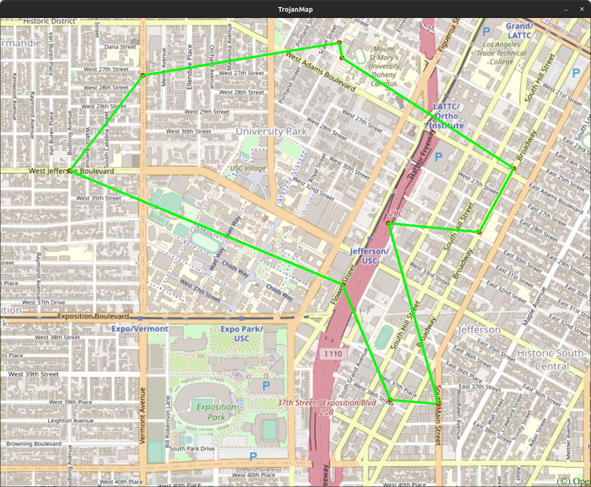
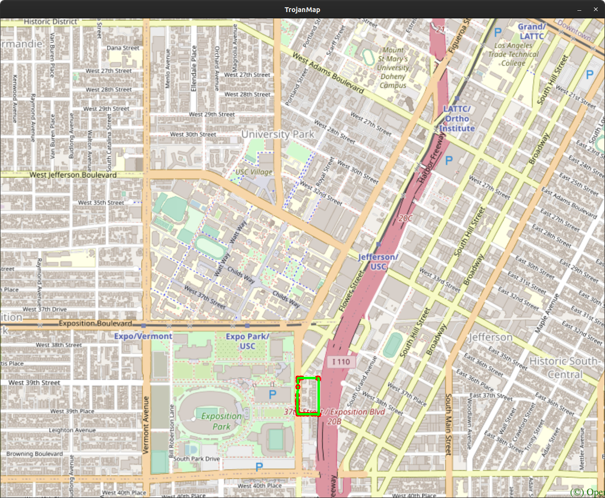
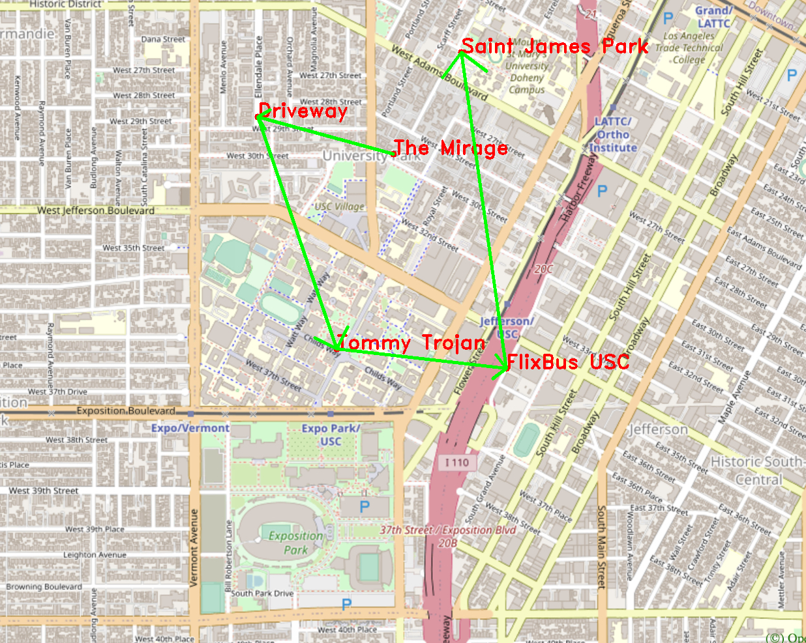

# Trojan Map

This is the final project of EE599 (Computer Principles) in Spring 2021 at University of Southern California.

Author: Haoxin Ma, Ziyou Geng  
Instructor: Arash Saifhashemi 

## Overview  

  ### Functionalities

  - Auto Complete location names
  - Find Coordinates
  - Calculate Shortest Path
    - Dijkstra
    - Bellman-ford
  - Traveling Salesman Problem
    - Brute-force
    - 2-opt
  - Cycle Detection
  - Topological Sort

  ### Data structure  

  ```c++
class Node {
    public:
    string id;                 // A unique id assigned to each point
    double lat;                // Latitude
    double lon;                // Longitude
    string name;               // Name of the location
    vector<string> neighbors;  // List of the ids of all neighbor points
};

class TrojanMap {
    public:
    map<string, Node> data;    // A map of ids to Nodes
    ...
};
  ```

## Time Complexity Analysis and Results 

  ### Auto Complete location names  
  ```c++
vector<string> TrojanMap::Autocomplete(string name) {
    ...
        for (auto pr : data) { // O(v)
            transform(pr.second.name.begin(), pr.second.name.end(), str.begin(), ::tolower); // O(l)
            ...
        }
    ...
}
  ```

Time complexity: O(v*l),

where v is the number of vertices (locations), l is the max length of a location name 

> Example:
>
> Input: "k"
>
> Result:  
>
> ```
> *************************Results******************************
> Kentucky Fried Chicken
> Korean Presbyterian Church
> Kobunga Korean Grill
> Kaitlyn
> **************************************************************
> ```
> Time taken: 1.848 ms

  ### Find Coordinates  
  ```c++
pair<double, double> TrojanMap::GetPosition(string name) {
    ...
        for (auto pr : data) {...} // O(v)
    ...
}
  ```
Time complexity: O(v),

where v is the number of vertices (locations)  

> Example: 
>
> Input: "Kentucky Fried Chicken"
>
> Result:
> 
>
> Time taken:  0.791 ms

  ### Calculate Shortest Path  
  #### Dijkstra
  ```c++
  ... 
while (!q.empty()) { 
  ...                                     // O(v)
  for (auto nb_id : data[id].neighbors) { // O(e)
      ...
      q.push(make_pair(new_dis, nb_id));  // O(log(e))
    }
  }
}
...
  ```
  
Time complexity: O(v + e*log(e)),

where v is the number of vertices (locations), e is the number of edges (paths) 


  #### Bellman-ford  
  ```c++
vector<string> TrojanMap::CalculateShortestPath_Bellman_Ford(string location1_name, string location2_name) {
    ...
        for (int i = 0; i < data.size() - 1; i++) {          // O(v)
            ...
            for (auto &id : updated_pre) {                   // -+
                                                             //  +-> O(e)
                for (auto &nb_id : data[id].neighbors) {...} // -+
                ...
            }
            ...
        }
    ...
}
  ```
Time complexity: O(v*e),

where v is the number of vertices (locations), e is the number of edges (paths) 

> Example: 
>
> Input: Target, Popeyes Louisiana Kitchen
>
> **Result of Dijkstra:**
>
>   
>
> Time taken: 6.419 ms
>
> **Result of Bellman-ford:**
>
>   
>
> Time taken: 22.176 ms

  ### Traveling Salesman Problem  
  #### Brute-force  

```c++
pair<double, vector<vector<string>>> TrojanMap::TravellingTrojan(vector<string> &location_ids);
void TrojanMap::TravellingTrojan_(vector<string> &ids, vector<vector<string>> &paths, vector<string> &cur_path,
                                  double &cur_dis, double &min_dis);
```

 

Solving TSP using brute-force is just like a permutation which is shown above.

Time complexity:  O((v-1)!),

where v is the number of vertices (locations)

  #### 2-opt  
Time complexity: 

> Example:
>
> Input: {"123120189",  "4011837229", "4011837224", "2514542032", "2514541020",  "1931345270", "4015477529", "214470792",  "63068532",   "6807909279"}
>
> **Result of Brute-force:**
>
>   
>
> The distance of the path is: 4.61742 miles
>
> Time taken: 166.724 ms
>
> **Result of 2-opt:**
>
>   
>
> The distance of the path is: 4.61742 miles
>
> Time taken: 0.733 ms

  ### Cycle Detection  

```c++
bool TrojanMap::CycleDetection(vector<double> &square);
bool TrojanMap::CycleDetection_(string &id, string &parent, unordered_map<string, bool> &visited);
```

Cycle detection is a kind of DFS.

Time complexity:  O(v+e),

where v is the number of vertices (locations), e is the number of edges (paths) 

> Example:
>
> Input: {-118.295, -118.27, 34.025, 34.015}
>
> Result:
>
>   
>
> There exists at least one cycle in the subgraph
>
> Time taken: 37.350 ms

  ### Topological Sort  

```c++
vector<string> TrojanMap::DeliveringTrojan(vector<string> &locations, vector<vector<string>> &dependencies);
```

Time complexity:  O(n * m),

where n is the number of vertices (locations), m is the number of edges (paths) 


> Example:
> 
> Input: {"Cardinal Gardens", "Coffee Bean1", "CVS"},  {{"Cardinal Gardens", "Coffee Bean1"}, {"Cardinal Gardens", "CVS"}, {"Coffee Bean1", "CVS"}}
>
> Result: { "Cardinal Gardens", "Coffee Bean1", "CVS" } 
> 
>  
> 
> Time taken:  42938 microseconds
## Source Code Dependencies 

- ### gcc

  ```shell
  sudo apt update
  sudo apt install build-essential
  ```

- ### Bazel

  See https://docs.bazel.build/versions/4.0.0/install-ubuntu.html#install-on-ubuntu

- ### git

  ```shell
  sudo apt update
  sudo apt install git
  ```

- ### OpenCV

  ```shell
  mkdir ./opencv
  git clone https://github.com/opencv/opencv.git
  sudo apt update
  sudo apt install libgtk2.0-dev libcanberra-gtk-module libcanberra-gtk3-module
  cd opencv/
  mkdir build install
  cd build/
  cmake -D CMAKE_INSTALL_PREFIX= ../install\
   -D BUILD_LIST=core,highgui,imgcodecs,imgproc,videoio\
   -D WITH_TBB=ON -D WITH_OPENMP=ON -D WITH_IPP=ON\
   -D CMAKE_BUILD_TYPE=RELEASE -D BUILD_EXAMPLES=OFF\
   -D WITH_NVCUVID=ON\
   -D WITH_CUDA=ON\
   -D BUILD_DOCS=OFF\
   -D BUILD_PERF_TESTS=OFF\
   -D BUILD_TESTS=OFF\
   -D WITH_CSTRIPES=ON\
   -D WITH_OPENCL=ON ..
  make install
  ```

## Directory Description

`./bazel-*`			GoogleTest output files  
`./opencv`			OpenCV source files  
`./src`				C++ source files  
`./tests`			GoogleTest files  
`./ncurses.BUILD`	ncurses build file  
`./opencv.BUILD`	OpenCV build file  
`./WORKSPACE`		bazel build file  
